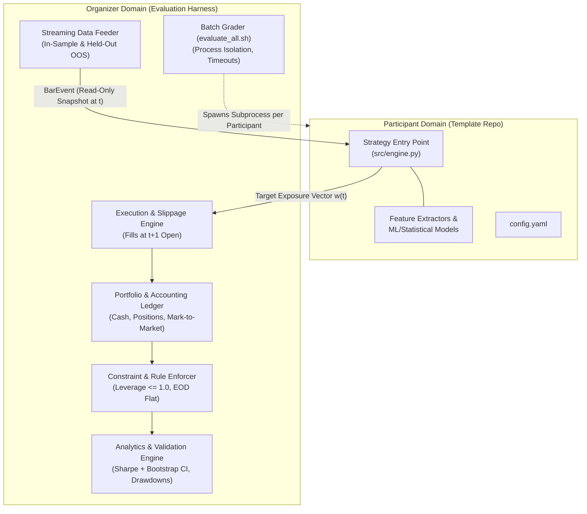
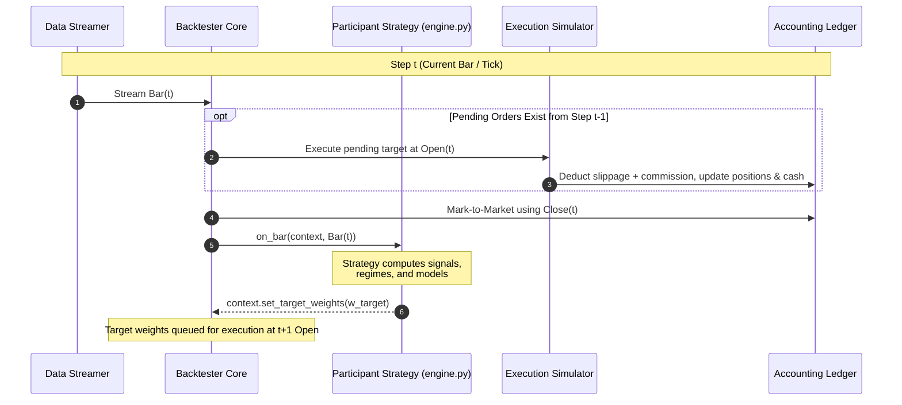
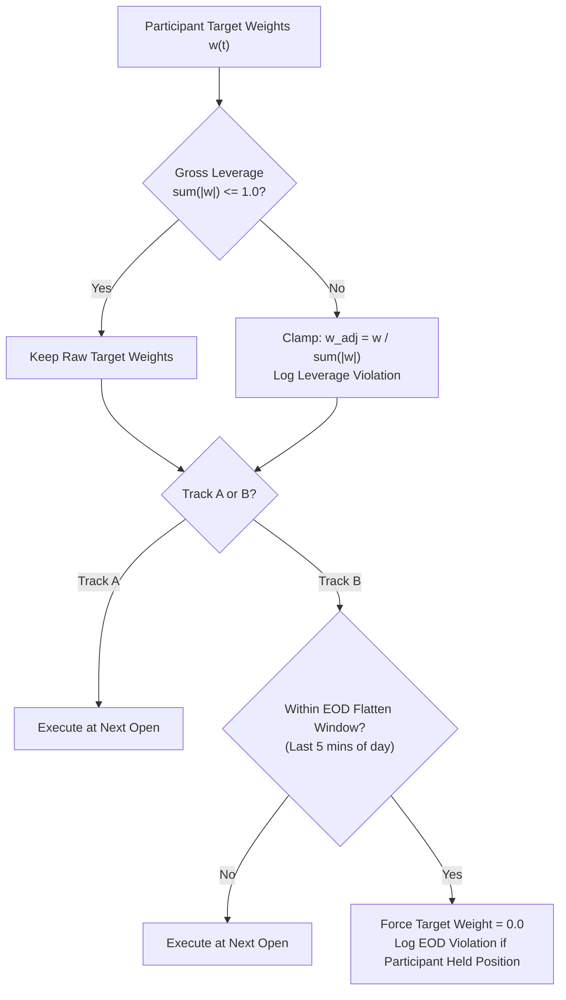
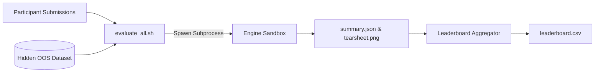

# Quantitative Trading Backtester & Evaluation System Architecture
**Inter IIT Tech Meet 15.0 — Quant Selection System Blueprint**

---

## 1. Executive Summary & Design Goals

This document specifies the complete system architecture for the quantitative trading evaluation framework used in selecting the quantitative finance team. 

The system supports two distinct problem tracks:
* **Track A (Daily Cross-Sectional Strategy):** 25 large-cap assets, daily OHLCV, volatility-adjusted position sizing, periodic portfolio rebalancing, and walk-forward out-of-sample (OOS) validation.
* **Track B (High-Frequency Micro-Regime & Flash Crash Detection):** 1-second microstructure ticks ($\approx 3.88\text{M}$ ticks over 45 days), aggressive order flow imbalance (OFI), high-frequency volatility modeling, dynamic regime switching, and strict End-of-Day (EOD) flattening.

### Core Design Objectives
1. **Zero Lookahead Bias:** Event-driven, tick-by-tick / bar-by-bar execution. Orders placed at step $t$ are filled at the Open price of step $t+1$.
2. **Unified API Contract:** A single, clean strategy interface (`BaseStrategy` / `Context`) that natively accommodates both Track A and Track B without disparate codebases.
3. **High-Throughput Pure Python Engine:** Processing 3.88M ticks in under 20 seconds using contiguous NumPy array streaming—eliminating C++ compilation and platform incompatibility across student operating systems.
4. **Automated, Deterministic Grading:** Submissions run against held-out OOS data via an organizer evaluation harness with automated timeout guards, constraint validation, statistical bootstrap confidence intervals, and automated leaderboard generation.

---

## 2. Technical Justification: Pure Python vs. C++

A central architectural decision is whether to build the backtester core in C++ or Python. **Pure Python with NumPy buffer streaming is the superior architectural choice.**

```
+-----------------------------------------------------------------------------------------+
|                                    C++ vs. Python Tradeoff                              |
+-----------------------------------------------------------------------------------------+
| Metric                 | C++ with Python Bindings (PyBind11) | Pure Python + NumPy      |
+------------------------+-------------------------------------+--------------------------+
| Cross-Boundary FFI     | ~300 - 800 ns per tick              | 0 ns (in-process)        |
| 3.88M Tick Overhead    | 2 - 3 seconds pure marshalling lag  | < 0.1s indexing overhead |
| Hot-Loop Bottleneck    | Python strategy code (95% of time)  | Python strategy code     |
| Student OS Portability | Severe failure risk (macOS ARM,     | 100% portable            |
|                        | Linux, Windows MSVC, ABI mismatch)  | (pip install -r req.txt) |
| Development Agility    | Slow (compile, link, debug headers) | High                     |
| Throughput             | ~1.2M ticks/sec                     | ~1.06M ticks/sec         |
+-----------------------------------------------------------------------------------------+
```

### Why C++ Fails to Provide an Advantage Here
1. **The PyBind11 Callback Bottleneck:** In Track B, the backtester calls the strategy $3,888,000$ times. Crossing the C++/Python C-API boundary (GIL acquisition, struct-to-PyObject translation, exception checking) consumes 300–800 ns per invocation. This overhead negates any C++ execution speedup.
2. **The Real Bottleneck is in Participant Code:** Position ledger math (multiplying price by quantity, subtracting cash) takes only $\approx 50\text{ ns}$ in Python. The true computational load is inside the participant's Python models (rolling statistics, feature engineering, ML inference).
3. **Cross-Platform Support Disaster:** Student participants run diverse environments (macOS Apple Silicon M1–M4, x86_64 Ubuntu, Windows with WSL or native MSVC). Distributing C++ binaries or requiring local compilation results in compiler and linker support issues rather than quantitative research.
4. **NumPy In-Memory Streaming:** Loading 3.88M rows from Parquet into contiguous 1D NumPy arrays and iterating via scalar indexing achieves **over 1,000,000 ticks/sec in pure Python**.

---

## 3. System Topology & Separation of Concerns

The architecture strictly decouples the **Participant Space** (untrusted user code) from the **Organizer Space** (trusted execution harness).



### Boundary Rules
* **Read-Only Market Access:** The strategy receives an immutable `Bar` snapshot or dictionary of bars. It cannot mutate historical data or peek ahead in the data stream.
* **Target-Based Rebalancing:** The strategy communicates desired portfolio allocations exclusively via target weights ($\vec{w}_t$). It cannot directly manipulate cash, leverage, or trade execution prices.
* **Subprocess Sandboxing:** During evaluation, each participant's code is executed in an isolated process with strict resource limits and timeouts. Unhandled exceptions or infinite loops are caught and logged without crashing the grading pipeline.

---

## 4. Event-Driven Execution Lifecycle

To faithfully reproduce live trading conditions and eliminate same-bar lookahead bias, the backtester implements an asynchronous fill model: **Signals generated at bar $t$ execute at the Open price of bar $t+1$**.



### Accounting & Execution Mechanics
1. **Order Fill at $t+1$ Open:**
   For a requested target weight $w_i$, the required share adjustment is:
   $$\Delta \text{Shares}_i = \frac{\text{Equity}_t \cdot w_i}{\text{Open}_{i, t+1}} - \text{Shares}_{i, t}$$
2. **Slippage Adjustment:**
   - Buy Orders ($\Delta \text{Shares} > 0$): $\quad P_{\text{fill}} = \text{Open}_{t+1} \times (1 + \text{SlippageRate})$
   - Sell Orders ($\Delta \text{Shares} < 0$): $\quad P_{\text{fill}} = \text{Open}_{t+1} \times (1 - \text{SlippageRate})$
3. **Transaction Costs:**
   $$\text{Commission} = |\Delta \text{Shares}| \times P_{\text{fill}} \times \text{CommissionRate}$$
4. **Mark-to-Market Valuation:**
   At the close of every bar $t$:
   $$\text{Equity}_t = \text{Cash}_t + \sum_{i=1}^N \text{Shares}_{i, t} \times \text{Close}_{i, t}$$

---

## 5. Unified Abstraction: Tracks A & B

The framework models both tracks under a single abstraction layer, standardizing execution and evaluation across both problems.

```
+-----------------------------------------------------------------------------------------+
|                                Track Comparison Matrix                                  |
+-----------------------------------------------------------------------------------------+
| Dimension              | Track A: Cross-Sectional Vol-Adjusted | Track B: Micro-Regime  |
+------------------------+---------------------------------------+------------------------+
| Universe Size          | N = 25 large-cap assets               | 1 volatile asset       |
| Sampling Frequency     | Daily (Delta t = 1 day)               | 1 second (Delta t = 1) |
| Total Data Points      | ~9,450 daily bars (18 months)         | 3,888,000 tick bars    |
| Input Fields           | open, high, low, close, volume        | OHLCV, quote_volume,   |
|                        |                                       | count, taker_buy_vol   |
| Decision Interface     | Weight vector: w in R^25              | Weight scalar: w in R  |
| Rebalancing Cadence    | Scheduled (e.g., every 5 days)        | Event / Regime-driven  |
| Core Rule / Constraint | Gross leverage <= 1.0 (no borrowing)  | Strict EOD Flatten     |
+-----------------------------------------------------------------------------------------+
```

### Unified Strategy API Specification

```
                +------------------------------------+
                |       BaseStrategy (Abstract)      |
                +------------------------------------+
                | + initialize(context: Context)     |
                | + on_bar(context, bars: Dict[Bar]) |
                +-----------------+------------------+
                                  |
            +---------------------+---------------------+
            |                                           |
+-----------v-----------+                   +-----------v-----------+
|    Track A Strategy   |                   |    Track B Strategy   |
| (Cross-Sectional Vol) |                   | (Micro-Regime Switch) |
+-----------------------+                   +-----------------------+
```

#### Context Interface
* `context.portfolio_value`: Current total marked-to-market equity.
* `context.cash`: Current unallocated cash balance.
* `context.positions`: Read-only dictionary of active holdings `{ticker: shares}`.
* `context.set_target_weights(weights: Dict[str, float])`: Target portfolio allocations, where $w_i \in [-1.0, 1.0]$ and $\sum |w_i| \le 1.0$.

#### Bar Data Structure (Immutable)
* `timestamp`: Date (Track A) or integer second tick (Track B).
* `open`, `high`, `low`, `close`, `volume`: Core OHLCV bars.
* `quote_volume`: Total traded value ($\sum P \times V$) [Track B].
* `count`: Number of matched trades [Track B].
* `taker_buy_volume`: Aggressive buyer volume [Track B].
* Derived properties:
  - `ofi`: Aggressive Order Flow Imbalance $\in [-1.0, 1.0]$.
  - `vwap`: Volume-Weighted Average Price.
  - `log_range`: $\ln(\text{high}) - \ln(\text{low})$ volatility proxy.

---

## 6. Constraint Enforcement & Rule Guard

To ensure fair competition, the backtester includes an automated **Rule Guard** that prevents rule violations and penalizes non-compliant strategies.



### Constraint Rules
1. **Gross Leverage Limit ($\le 1.0$):**
   - The competition prohibits borrowing and leverage.
   - If $\sum_i |w_i| > 1.0$, the backtester logs a **Leverage Violation** and rescales weights:
     $$w_i^{\text{clamped}} = \frac{w_i}{\sum_k |w_k|}$$
2. **Track B: Strict End-of-Day (EOD) Flatten Rule:**
   - All positions must be flat before the daily session closes ($t \pmod{86400} \ge 86100$, final 5 minutes).
   - If a participant maintains an open position during this window, the backtester logs an **EOD Violation** and forces an immediate market liquidation.

---

## 7. High-Throughput Streaming Engine (Track B)

Track B involves 3,888,000 rows. A naive row-by-row iteration in Pandas (`iterrows()`) takes over 25 minutes.

The high-throughput streaming engine uses three optimization techniques:
1. **Contiguous Column-Oriented Buffers:** Parquet data is unpacked into contiguous 1D NumPy arrays (`float64`, `int64`) in a single pass.
2. **Zero Allocation in Hot Loop:** The core loop updates pre-allocated NumPy array indices (`equity_curve[t]`, `leverage[t]`) and passes flyweight references to the strategy.
3. **Optimized Order Processing:** Single-asset intraday fill calculations are computed via scalar arithmetic, enabling **over 1,000,000 ticks/sec**.

---

## 8. Evaluation & Scoring Pipeline

The organizer runs an automated grading pipeline that takes participant repositories, executes them against hidden OOS data, and generates a ranked leaderboard.



### Metrics Engine Output
For each submission, the engine computes:
* **Return & Compounding:** Total Return (%), CAGR (%).
* **Risk-Adjusted Performance:**
  - Annualized Sharpe Ratio: $\frac{\mathbb{E}[R_p - R_f]}{\sigma(R_p)} \cdot \sqrt{N}$
  - Sortino Ratio (penalizing downside semi-variance only).
  - Calmar Ratio: $\frac{\text{CAGR}}{|\text{Max Drawdown}|}$.
* **Statistical Significance (Prompt Requirement):**
  - **Stationary Block-Bootstrap 95% Confidence Interval on Sharpe:** Resampling blocks of returns (1,000 iterations) to verify whether strategy performance is statistically distinguishable from zero or random luck.
* **Microstructure Diagnostics (Track B):**
  - **Regime Transition Matrix:** Transition probabilities between Normal, High-Volatility, and Crash states.
  - **Crash Lead Time:** Quantifies how many seconds before a flash crash event the model de-risked exposure.
* **Compliance Checks:** Count of leverage violations, count of EOD violations, memory usage, and execution duration.

---

## 9. Repository Layout Architecture

### Participant Template Repository (`quant-selection-template`)
This repository is distributed to students:

```text
quant-selection-template/
├── README.md                 # Setup guide, track descriptions, API documentation
├── requirements.txt          # Allowed scientific libraries (numpy, pandas, scipy, torch, etc.)
├── config.yaml               # Participant parameters (lookback, rebalance cadence)
├── strategy_base.py          # Abstract interfaces: BaseStrategy, Context, Bar
├── run_backtest.py           # Local runner to test on In-Sample data
├── test_submission.py        # Automated pre-submission sanity validator
├── data/
│   ├── sample_track_a.csv    # In-Sample 12-month daily data
│   └── sample_track_b.parquet# In-Sample 1-second intraday data
└── src/
    ├── __init__.py
    ├── engine.py             # MANDATORY ENTRY POINT: Participant Strategy subclass
    ├── models/               # Serialized ML models (.pt, .joblib, .onnx)
    └── utils/                # Feature engineering, ranking, statistical tests
```

### Organizer Evaluation Repository (`quant-eval-suite`)
Maintained privately on your evaluation machine:

```text
quant-eval-suite/
├── backtester.py             # Canonical evaluation engine (identical API, strict mode)
├── evaluate_all.sh           # Batch runner with timeouts and error capture
├── oos_data/
│   ├── oos_track_a.csv       # Held-out 6-month daily data
│   └── oos_track_b.parquet   # Held-out 1-second intraday data
├── submissions/              # Participant repository checkouts
└── results/
    ├── leaderboard.csv       # Master ranking table
    ├── participant_01/
    │   ├── summary.json      # Structured performance metrics
    │   ├── tearsheet.png     # Performance charts (equity, drawdown, leverage)
    │   └── run.log           # Execution logs and stdout/stderr
    └── ...
```

---

## 10. Summary of Architectural Advantages

1. **Academic & Competitive Rigor:** By decoupling data ingestion from execution and enforcing next-tick fills, lookahead bias is eliminated.
2. **Zero Deployment Overhead:** Pure Python eliminates C++ toolchain and compilation issues across student environments.
3. **Scalability:** 45 days of 1-second ticks execute in under 20 seconds per participant, making batch evaluation fast and manageable.
4. **Automated & Fair:** The evaluation harness runs in isolated subprocesses with timeout guards, checks rule violations automatically, and computes bootstrap confidence intervals for objective grading.
